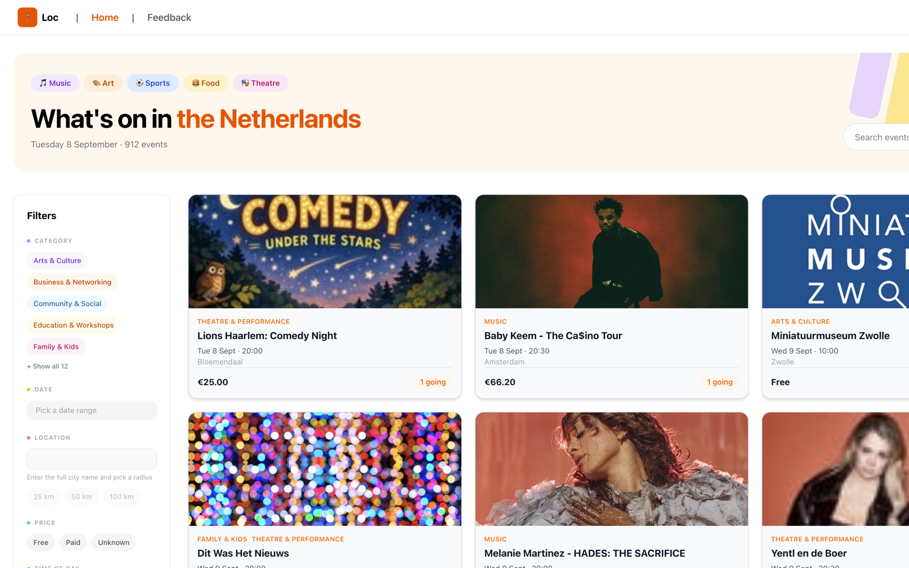
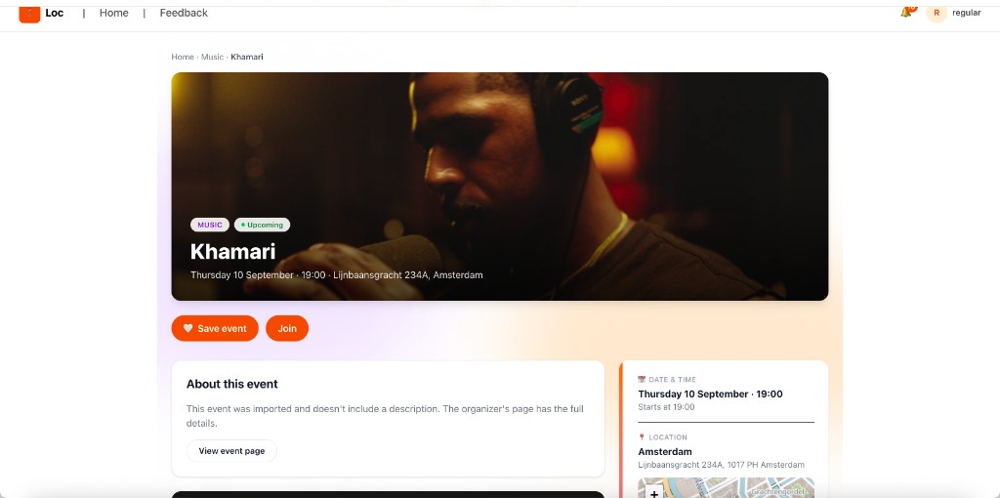
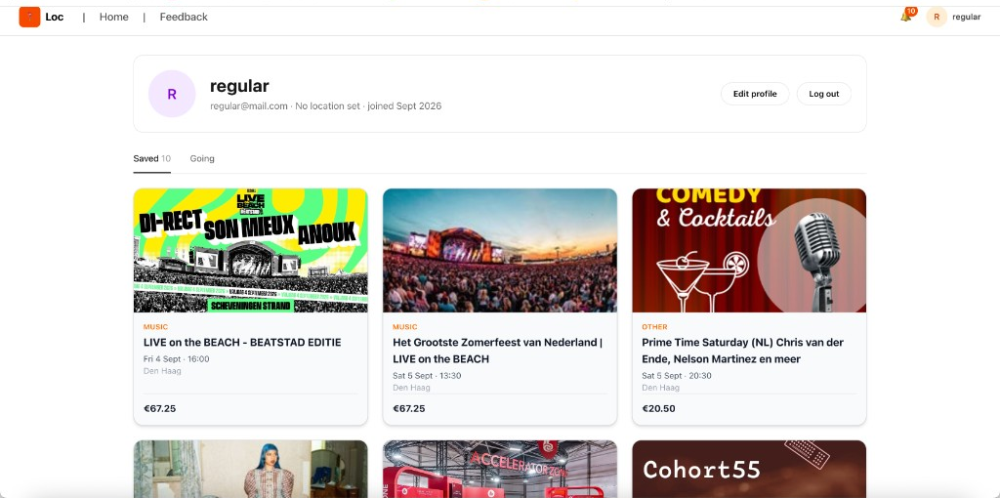
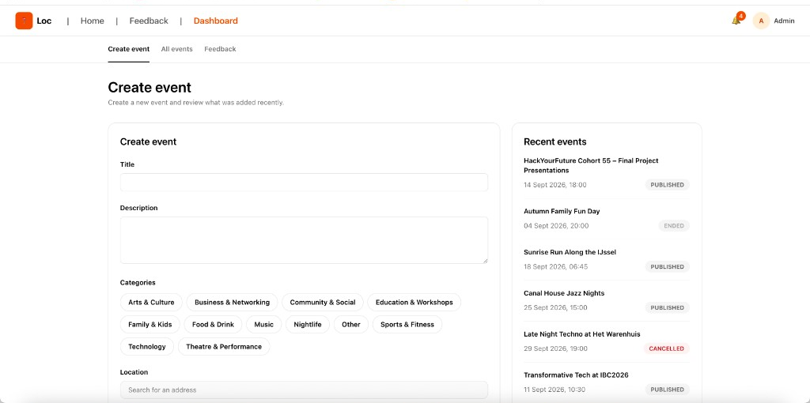
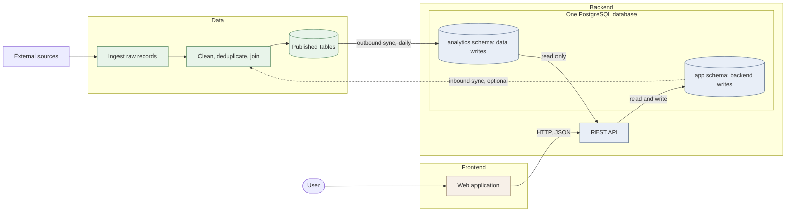

# Loc Events — HackYourFuture Final Project

Built by Class 55, Group A.

This is our final project for the [HackYourFuture program](https://hackyourfuture.net/program), built as a
team with three roles: frontend, backend, and data engineering. We worked in an agile way, in short
sprints, supported by a group of mentors: a Product Manager and Tech Leads. The project is open source and available
on GitHub.

### 🌐 [Live demo](https://c55a.hyf.dev)

Demo video: coming soon.

---

## Table of contents

- [About the project](#about-the-project)
- [Screenshots](#screenshots)
- [Features](#features)
- [Tech stack](#tech-stack)
- [Architecture](#high-level-architecture)
- [Project structure](#project-structure)
- [Documentation](#documentation)
- [CI/CD](#cicd)
- [Team](#team)
- [Roadmap](#roadmap)

---

## About the project

**Loc Events** is a web app for finding something to do in the Netherlands. Ticketmaster events and events created by
admins land in one feed, so you do not have to check several sites.

Anyone can browse what is on. Signed-in users can save events, mark Going, and get reminded. Admins add and manage
events in the same product.

---

## Screenshots

Two or three shots of the most important screens. Image files live in [`screenshots/`](screenshots).









---

## Features

**Discover events**

- Search by title, description, city, or category
- Filter by category, date range, distance, free/paid, and time of day
- Sort by soonest, popularity, or price

**Event page**

- Description, or a link to the organizer for imported events
- Date, price, and how many people are going
- Map of the address
- Weather at start time
- Similar events
- Comments
- Ask-a-question chat (what it is, the weather, how to get there)
- Save an event or mark Going (signed in)

**Notifications**

- Reminder about a day before an event you marked Going
- Cancel and update alerts for events you saved or are going to
- Notice when an admin replies to your comment

**Accounts and admin**

- Sign in with email or Google
- Profile with Saved and Going
- Admins create, edit, and cancel events, and read feedback

---

## Tech stack

| Layer              | Technologies                                                      |
|--------------------|-------------------------------------------------------------------|
| **Frontend**       | Next.js, React, TypeScript, Biome                                 |
| **Backend**        | Java 25, Spring Boot, PostgreSQL, Flyway, Maven                   |
| **Data**           | Python, SQL, dbt, PostgreSQL, Databricks, Airflow                 |
| **Infrastructure** | Docker, Docker Compose, GitHub Actions, GitHub Container Registry |

## High-level Architecture

Three tracks, three layers, and one database where two of them meet.



The application database holds two schemas. **`analytics`** is written by the
data pipeline and read by the backend. **`app`** holds accounts, saved items and
anything the application's own admins create, and only the backend writes it.

The architecture follows three principles:

- **The two schemas have two owners.** The data pipeline writes `analytics` and
  nothing else. The backend writes `app` and nothing else. Neither side has
  permission to write the other's, which is enforced by two database roles
  rather than by everyone remembering.
- **The data track publishes finished tables, not raw material.** The backend
  should be able to fill a screen with one `SELECT`, without joining sources or
  knowing where a row came from.
- **Records the application creates stay on the application's side.** If an
  admin adds a record by hand and the same thing later arrives from an external
  source, deciding they are the same thing is application logic. It happens
  behind the API, not in the pipeline.

## Project structure

```
.
├── backend/            Spring Boot REST API (Java, Maven, Flyway)
├── frontend/           Next.js web app (TypeScript, React)
├── data/               Data pipeline (Python, dbt, Airflow)
├── scripts/            Scripts for local development and deployment
├── screenshots/        Images used in this README
├── .github/workflows/  CI/CD pipelines and other workflows
```

## Documentation

| What                        | Where                                                                  |
|-----------------------------|------------------------------------------------------------------------|
| Frontend guide              | [`frontend/README.md`](frontend/README.md)                             |
| Backend guide               | [`backend/README.md`](backend/README.md)                               |
| Data pipeline guide         | [`data/README.md`](data/README.md)                                     |
| Event similarity            | [`backend/docs/event-similarity.md`](backend/docs/event-similarity.md) |
| Notifications               | [`backend/docs/notifications.md`](backend/docs/notifications.md)       |
| Event list & detail         | [`backend/docs/events.md`](backend/docs/events.md)                     |
| Live API reference (Scalar) | https://c55a.hyf.dev/api/docs                                          |

## CI/CD

Two GitHub Actions workflows run automatically:

| Workflow                                                | Triggers on                 | What it does                                                        |
|---------------------------------------------------------|-----------------------------|---------------------------------------------------------------------|
| [Backend CI/CD](.github/workflows/backend-ci-cd.yaml)   | changes under `backend/**`  | Checkstyle, tests, Docker build; pushes the image to GHCR on `main` |
| [Frontend CI/CD](.github/workflows/frontend-ci-cd.yaml) | changes under `frontend/**` | Lint, build, Docker build; pushes the image to GHCR on `main`       |

Pull requests are only merged when their checks pass.

## Team

| Name             | Role             | GitHub                                                         |
|------------------|------------------|----------------------------------------------------------------|
| Diana Chukhrai   | Frontend         | [@dianadenwik](https://github.com/dianadenwik)                 |
| Shadi Abedinpour | Backend          | [@shmoonwalker](https://github.com/shmoonwalker)               |
| Yana Pechenenko  | Backend          | [@YanaP1312](https://github.com/YanaP1312)                     |
| Pavel Tisner     | Data engineering | [@pavel-tisner](https://github.com/pavel-tisner)               |
| Mohammed Alfakih | Data engineering | [@mohammedalfakih-dev](https://github.com/mohammedalfakih-dev) |

**Mentors**

| Name           | Role                 |
|----------------|----------------------|
| Dickson Chu    | Product Manager      |
| Sami Haddad    | Tech Lead — frontend |
| Stas Seldin    | Tech Lead — backend  |
| Lasse Benninga | Tech Lead — data     |

## Roadmap

- [ ] More event sources besides Ticketmaster
- [ ] Recommendations based on what you saved or marked Going, not only similar events
- [ ] A clearer admin role, with tighter app logic and design

---

Thanks to [HackYourFuture](https://hackyourfuture.net/program) for the programme, the mentors, and the space to build
this.
